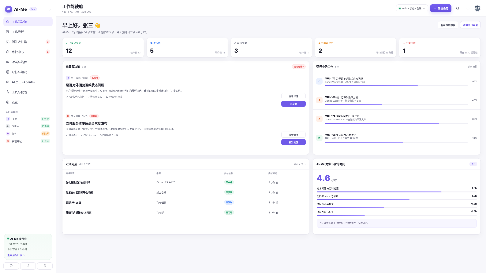
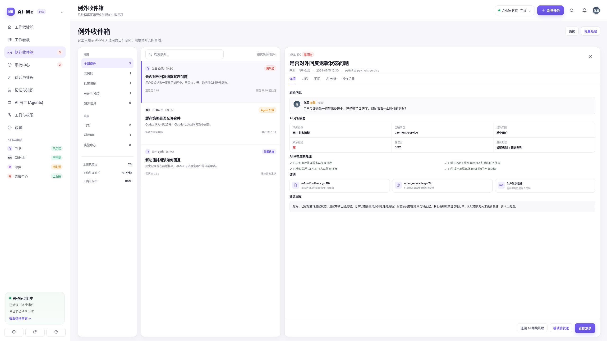
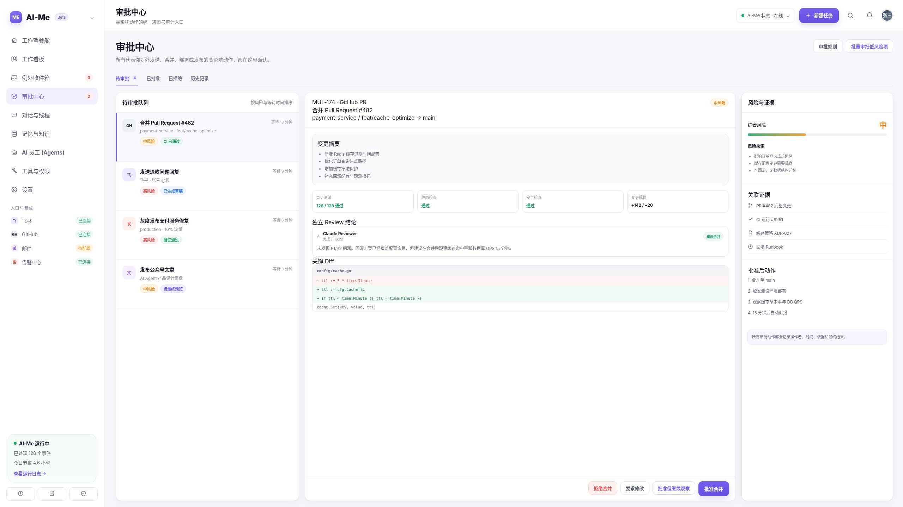
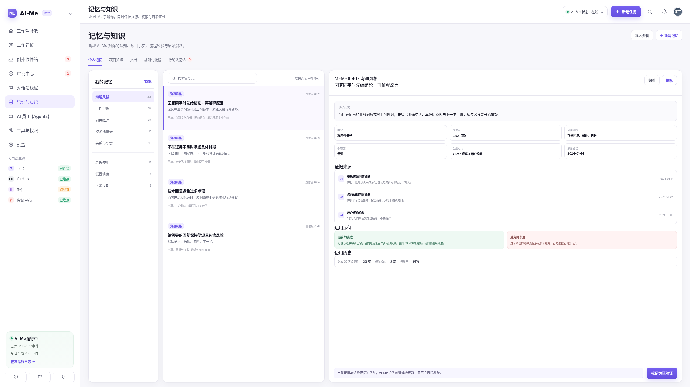
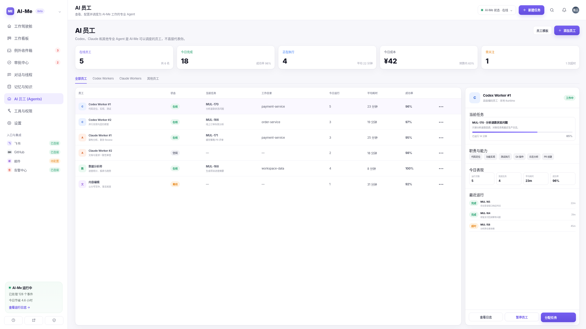
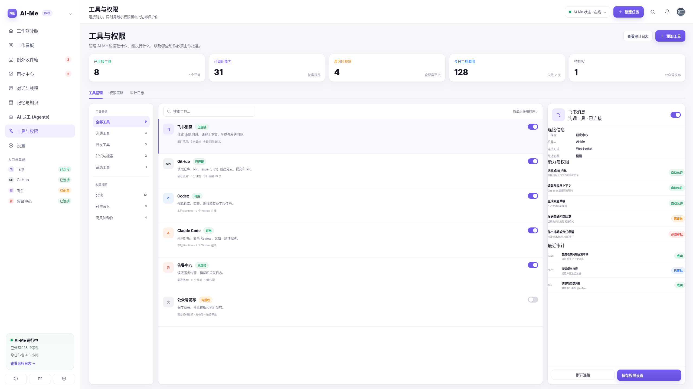

# AI-ME

AI-ME 是一个仍在开发中的个人工作驾驶舱，用来统一调度 AI 员工、处理例外消息、审批高风险动作、沉淀记忆与知识。

> 当前状态：项目仍处于开发阶段。API、数据库表、UI 文案和产品流程都可能快速调整，请不要按生产可用版本理解。

AI-ME 基于现有 Multica Agent 管理底座继续演进。当前设计方向是：AI-ME 自己直连 LLM API 作为“大脑”和工作中枢；Codex、Claude Code 等工具继续通过现有 Agent Runtime 作为可调度的“AI 员工”执行任务。

## AI-ME 是什么

AI-ME 不是一个普通聊天窗口，而是一个面向个人工作的代理层。它希望逐步做到：

- 接收来自飞书、GitHub、Issue、后续邮件等系统的工作信号；
- 通过兼容 OpenAI Chat Completions 的 LLM API 做判断，例如 DeepSeek；
- 对高风险或对外动作生成待审批事项，而不是直接执行；
- 在用户批准后，把任务分配给 Codex、Claude Code 等 AI 员工；
- 用可治理的记忆与知识保存项目事实、个人偏好、流程规则和证据来源。

v0.1 阶段优先打通这个最小闭环：

```text
工作信号
-> AI-ME 分析
-> 审批门
-> 创建任务 / 分配员工 / 生成回复草稿
-> 执行结果与审计记录
-> 记忆与知识复用
```

## 当前范围

当前项目已经包含或正在实现：

- **工作驾驶舱**：集中查看需要我决策、AI 员工运行、风险和最近活动。
- **AI 员工**：Codex、Claude Code 等 Agent Runtime 继续作为可分配员工。
- **例外收件箱**：外部或内部信号进入 AI-ME 分析后，可转成建议动作和审批事项。
- **审批中心**：高风险动作会持久化，用户可以批准、驳回、接管或继续观察。
- **记忆与知识**：管理用户偏好、项目事实、流程规则、证据来源和候选记忆。
- **LLM 大脑接入**：AI-ME 可配置 OpenAI-compatible LLM API；本地开发优先接 DeepSeek，主要因为成本更可控。
- **外部动作基础**：飞书 webhook 和审批后的外部回复链路正在逐步接入。

## UI 方向

下面几张是用 GPT 生成的 AI-ME UI 概念稿，只作为产品方向参考，不代表最终生产界面。

<table>
  <tr>
    <td></td>
    <td></td>
    <td></td>
  </tr>
  <tr>
    <td></td>
    <td></td>
    <td></td>
  </tr>
</table>

完整 UI 参考图见 [docs/ai-me-ui-reference.md](docs/ai-me-ui-reference.md)。

## 技术架构

AI-ME 当前仍复用原 Multica 的工程结构，产品层正在逐步改造成 AI-ME：

```text
Next.js Web / Electron Desktop
        |
共享 views 与 core packages
        |
Go 后端 API + WebSocket 事件
        |
PostgreSQL 17 + pgvector
        |
本地 / 云端 Agent Runtime
        |
Codex、Claude Code 等 AI 员工 CLI
```

主要目录：

- `server/`：Go 后端、handler、migration、sqlc query、实时事件。
- `apps/web/`：Next.js Web 应用。
- `apps/desktop/`：Electron 桌面端。
- `packages/core/`：无 UI 的 API client、schema、query hooks、类型和共享状态。
- `packages/views/`：共享业务页面和组件。
- `packages/ui/`：通用 UI 组件和设计 token。
- `docs/`：产品说明、PRD 和 UI 参考资料。

## 本地开发

环境要求：

- Node.js 22+
- pnpm 10.28+
- Go 1.26+
- Docker，用于本地 PostgreSQL

启动本地开发环境：

```bash
make dev
```

常用检查：

```bash
pnpm typecheck
pnpm test
make test
make check
```

## AI-ME 本地演示

如果你想快速看到 AI-ME 驾驶舱、审批中心、例外收件箱、记忆与 AI 员工调度的真实数据，可以先写入一组本地演示数据：

```bash
pnpm aime:demo
```

这个命令会创建或刷新 `ai-me-demo` 工作区，并执行烟测校验。脚本默认只允许写入本地 PostgreSQL，不会上传或写入任何 LLM API key。

更多说明见 [docs/ai-me-demo.md](docs/ai-me-demo.md)。

## 配置与敏感信息

本地配置从 `.env.example` 复制。

下面这些值只应该保留在本地或部署环境里，不要提交到仓库：

- LLM API key，例如 `AI_ME_LLM_API_KEY` 或 `DEEPSEEK_API_KEY`
- 飞书 app secret、webhook token
- OAuth secret
- 非本地环境的数据库密码

仓库只保留空占位和公开默认值，真实 `.env` 文件不应提交。

## 项目备注

- 这个仓库目前是从 Multica 底座演进出来的 AI-ME 开发版本。
- 部分内部 package name、CLI 名称和历史文档仍可能出现 Multica，这是迁移过程中的遗留命名。
- 项目尚未生产可用。
- “先审批，再执行”是 AI-ME 的核心安全边界：对外发送、重要数据修改、代码合并、生产动作和用户承诺都不应绕过审批链路。

## 开源协议

见 [LICENSE](LICENSE)。
