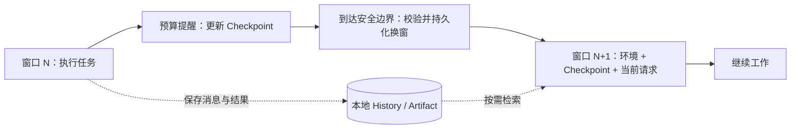

# 上下文管理与 Token Budget 设计

状态：方案已采用，已在功能分支实现；具体选择与验证边界见《上下文管理实现审核说明》。确认日期：2026-09-15。

## 1. 决策与边界

AI-ME 采用 Codex Token Budget 的换窗思路：在上下文预算不足时，启动新的模型上下文窗口，重新装配当前环境和任务接续信息。原会话、工具执行记录和工作区继续存在。

完整方案由五部分组成：Token Budget 换窗、本地 Checkpoint、历史检索、大工具结果 Artifact 存储、运行时预算与恢复保护。

“换窗不生成摘要”指不在每次换窗时对整段对话发起一次总结请求。Agent 平时仍需更新简短的任务笔记；本方案把这些笔记组织为结构化 Checkpoint。它仍有信息取舍，因此必须保留可检索的历史，不能声称无损记忆。

本文件保留设计契约。功能分支已接通窗口、Checkpoint、历史检索、产物和预算检查；具体实现选择、限制与复核方式见 [实现审核说明](./上下文管理实现审核说明.md)。尚未合并或发布。

## 2. 三种状态各自保存什么

| 状态 | 内容 | 新窗口如何使用 |
|---|---|---|
| 环境状态（World State） | 当前有效的指令、模型配置、工作区授权快照、工具能力及运行状态 | 由 Runtime 根据权威配置重新装配 |
| 任务接续状态（Checkpoint） | 目标、进展、约束、决策、失败尝试、下一步、证据引用 | 自动注入已校验、受预算限制的版本 |
| 历史与产物（History / Artifact） | 消息、工具调用及结果、长日志和文件读取结果快照 | 只注入索引和引用，详情按需检索 |

环境重建不会自动理解任务进展，也不会自动刷新全部代码内容。历史检索返回的是过去的事实；要判断文件现在的内容，仍需重新读取工作区。



## 3. 窗口与预算

一个 Session 包含多个 ContextWindow。换窗不创建新的 Session、Turn 或 Run，也不重置工具审批、模型步骤上限、失败次数和执行预算。

每次模型请求发送前，按照即将发送的完整请求计算预算：

```text
C = 模型配置的上下文容量
O = 本次允许生成的输出预留
S = 估算误差安全余量
I = 完整输入估算（指令 + 工具 Schema + Checkpoint + 消息 + 结果 + 协议开销）
H = C - O - S                     # 本次输入硬预算
R = H - I                         # 估算剩余输入空间
M = 保存接续状态所需的维护预留
```

- `R > M`：正常运行；工具结果回填后仍要重新计算。
- `0 <= R <= M`：进入维护阶段，提醒更新 Checkpoint 并准备换窗；Runtime 限制可执行操作为接续状态维护和换窗。
- `R < 0`：禁止发送当前请求；缩减可选内容并尝试安全换窗，重新检查是否能放入预算。

维护请求本身也必须通过完整预算检查。`M` 是硬预算内提前留出的空间，不能在容量之外追加一块“备用窗口”。不直接采用固定 80k、90% 或 Codex 示例中的数值作为所有模型的通用参数；实际值由模型容量、输出上限与维护开销共同确定。

Token 与字节分别计量。Tokenizer 或 Provider 计数能力通过端口提供；不支持时使用保守估算并标注 `estimated`，通过实际 usage 校准误差。缓存命中的输入仍占上下文容量；Session 累计用量不能用作当前窗口占用。

若环境、工具定义和当前必要输入自身已超过硬预算，换窗也无法解决。返回明确的 `context_base_too_large`，保留任务和错误原因，提示缩小输入或调整模型配置，不进入无限换窗。

## 4. Checkpoint 契约

Checkpoint 为不可变版本，至少包含：

| 字段 | 含义 |
|---|---|
| `checkpoint_id / version` | 稳定身份和版本 |
| `session_id / source_window_id` | 所属会话与来源窗口 |
| `covered_sequence` | 整理时已读取的历史边界，不代表语义完整性证明 |
| `goal / progress` | 当前目标与已确认进展 |
| `constraints / decisions` | 仍有效的用户约束、关键决策及依据 |
| `failed_attempts / next_steps` | 已失败的尝试与可继续执行的步骤 |
| `references` | 对应 `item_id / tool_invocation_id / artifact_id` 等引用 |

Agent 通过 `write_checkpoint` 提交完整的新版本；Runtime 检查大小、字段、引用归属和预期版本，禁止旧写入覆盖新版本。完成阶段工作、形成重要决策或收到预算提醒时更新。模型维护的内容作为任务数据注入，不能提升为系统指令或改变工具权限。

换窗时自动装入最新有效 Checkpoint，并检查其边界之后是否还有新事实：

1. 有维护预算时，最多请求一次更新；超长或无效提交返回具体错误。
2. 无法更新时，用最近有效版本加上结构化增量：当前请求、已记录状态、后续历史范围和待处理事项引用。
3. 增量不能替模型推断未记录的决策，标注接续状态不完整；新窗口先检索未覆盖历史，再继续依赖这些信息的工作。
4. 连最小接续信息都装不下，或必要记录不可用时，停止并报告明确错误；不得静默丢弃用户要求后继续执行。

模型步骤与维护请求共享既有 Run 上限；达到上限后只允许落盘已有事实并结束，不通过换窗绕过限制。

## 5. 换窗时序与崩溃恢复

`new_context` 仅申请换窗。Runtime 在当前模型响应完整结束、工具批次全部获得 T2 结果、没有待审批或结果不确定的工具时处理申请。维护工具采用独占调用，拒绝与其他工具混用。

1. 固定历史边界 `through_sequence`，取得当前窗口版本。
2. 校验 Checkpoint、未覆盖增量和所有引用，构建新窗口初始输入并检查预算。
3. 在一个 SQLite 事务内写入新窗口基线、Checkpoint 引用、旧窗口结束边界、换窗事件，并以 CAS 更新 Session 的活动窗口指针。
4. 事务提交后再替换内存中的活动上下文；后续模型请求带新的 `window_id`。

事务前崩溃：继续旧窗口。事务后、内存切换前崩溃：从数据库恢复新窗口。使用 `rollover_id` 唯一键去重，同一次申请不能创建两个窗口。若提交结果不确定，按该 ID 读取并对账后再决定是否继续。

当前请求在新窗口基线中只保留一次；最近消息属于可选预算项，不直接拼接固定条数。若保留工具协议消息，必须保留完整调用与结果组合；否则用已有 T2 事实及引用接续，不能制造悬空的 tool result。

换窗与接收新用户输入按 Session 串行化。实现中以事务边界内的版本和 sequence 判定是否需重建候选窗口，保证边界之后的输入进入后续上下文且不重复。

## 6. 大工具结果与历史读取

采用“正文落本地，模型先看有界预览和引用”。一个 80k 结果也可能超出小窗口预算，所以不能只设置固定 80k 阈值。

工具采集结果时应流式写入 Artifact，避免先把全部日志放入内存再截断。Artifact 文件写完并完成原子发布后，才在 T2 事务中提交可读取引用；未完成的文件不能作为完整结果引用。数据库提交失败留下的孤立文件由后续清理机制处理，不据此重复执行工具。

模型可见结果包含：工具调用身份、成功或失败、关键结构化字段、首尾预览、总字节数、是否截断、Artifact 引用和下一页读取方式。全文不同时复制到事件、账本和模型消息中。

单次内联上限取配置上限与当前请求可用预算的较小值；同一批并行工具共享结果总预算，并预留所有结果信封和下一次输出空间。失败信息与关键状态优先于普通正文。最终仍须对整个请求复核。

- `artifact_read`：按字节范围或行范围分页；服务端强制返回上限。
- `artifact_search`：按关键词检索有界片段，提供稳定游标或位置。
- `history_list / history_search / history_read`：按会话、窗口、角色、工具和条目检索，返回同样受预算约束。
- 普通 `read_file` 读取当前工作区；Artifact 工具读取已保存结果快照，不为访问内部文件扩大工作区权限。

输出生成量和磁盘容量另设资源上限。因采集限制未保存完整输出时，必须返回 `capture_complete=false` 及原因，不能声称可读全文。引用仅对当前授权会话可见，校验真实路径并阻止路径逃逸；在会话仍引用产物时不自动删除正文。

## 7. Provider 溢出兜底

协议适配器识别明确的上下文超限错误，归一化为 `context_window_exceeded`，交由 Runtime 决策，不能对所有 400 错误做相同处理。

同一次逻辑模型步骤最多执行一次溢出恢复：保存已有事实，缩减可选输入或换窗，重新校验后重新请求模型。恢复计数必须持久化，进程重启不能重置。重试请求仍计入 Run 的请求预算。

只复用 T2 已完成工具结果，不重执行副作用。若已有流式文本展示，保存失败尝试并标明状态，新尝试单独记录，避免重复文本被拼成一次回答。模型响应完整并通过工具调用校验后才执行工具。

第二次仍超限，或者基础输入本身超限时结束当前尝试，返回可定位原因。保留历史、Checkpoint 和产物供后续恢复。

## 8. 工程落点

| 层次 | 新增或调整职责 |
|---|---|
| Domain | 窗口身份、Checkpoint 版本、预算决策和换窗不变量 |
| Application | `ContextBudgetPlanner` 调用与窗口接续用例；定义 ContextStore、HistoryReader、ArtifactStore、TokenCounter 端口 |
| Infrastructure | SQLite 事务、Artifact 文件存储、Token 计数适配、Provider 错误归一化、Runtime 接入 |
| Presentation | 展示窗口编号、上下文用量、换窗状态和可解释错误；沿用现有事件链路 |
| Composition | 装配端口，不让 Domain 依赖框架或 Provider SDK |

计划新增 `context_windows`、`context_checkpoints`、`history_items` 与 Artifact 元数据表；具体迁移编号在实现时按当前 Alembic head 分配。

`runtime_events` 和工具账本继续保存执行事实，`history_items` 是适合模型检索的持久投影，以稳定源记录 ID 去重，不承担审批或副作用恢复决策。UI 仍使用 `session_items`。窗口基线和历史尾部共同构成可重建的模型上下文。

写入源事实和本地历史投影尽量使用同一事务；无法同事务的来源必须记录投影进度，换窗前等待或直接从源事实补齐所需边界。不能假设尚未写入索引的信息已经可检索。

## 9. 实现顺序与验收

按完整纵向切片推进，每步包含必要的领域行为、端口、适配器、事件及测试：

1. 大结果落盘与有界回填：覆盖普通读取、命令输出、并行批次和 Artifact 再读取。
2. 窗口、Checkpoint 和历史检索：持久化、工具接口、恢复和最小 UI 状态一并接通。
3. 自动维护与换窗：接入完整请求预算检查、事务切换及 Provider 单次恢复。
4. 长任务验收：用多轮任务检查接续质量、检索成本和运行恢复。

核心验收场景：

- 多次换窗后仍保留目标、约束、最新请求和下一步，历史引用可读。
- Checkpoint 过长、过期、缺失或引用错误时按约定更新、降级或报错。
- Checkpoint 加当前必要输入超限时明确结束，无无限维护或换窗。
- 多工具大结果及其分页读取不能绕过单请求预算；采集不完整如实标识。
- 换窗事务前后崩溃、重复申请、新输入与换窗相遇时无丢失、重复或双活动窗口。
- T2 后恢复复用结果；待审批和不确定工具不能借换窗绕过原恢复语义。
- OpenAI 与 Anthropic 请求保留合法的调用和结果关系；超限只恢复一次。
- 观察每个窗口的估算与实测用量、换窗原因、Checkpoint 版本、检索次数、恢复次数和错误原因；指标不复制完整敏感正文。

## 10. Codex 参考与本项目增强

参考固定源码快照 `0d46c252b3f29f10bacf0ef58a17a1aa5d17ead3`（2026-09-09），不据此断言当前产品默认启用该能力：

- [Token Budget 换窗入口](https://github.com/openai/codex/blob/0d46c252b3f29f10bacf0ef58a17a1aa5d17ead3/codex-rs/core/src/compact_token_budget.rs)：跳过模型或服务端摘要，执行新的上下文窗口生命周期。
- [窗口重建](https://github.com/openai/codex/blob/0d46c252b3f29f10bacf0ef58a17a1aa5d17ead3/codex-rs/core/src/session/mod.rs)：通过 World State 装配初始上下文并替换活动历史。
- [History / Notes 工具](https://github.com/openai/codex/blob/0d46c252b3f29f10bacf0ef58a17a1aa5d17ead3/codex-rs/ext/history-notes/src/tools.rs)：历史检索与笔记读写契约。

结构化 Checkpoint 自动注入、本地存储、事务提交后激活窗口、统一 Artifact 和单次溢出恢复是 AI-ME 的设计选择，不能当作上述 Codex 代码已经提供的保证。
